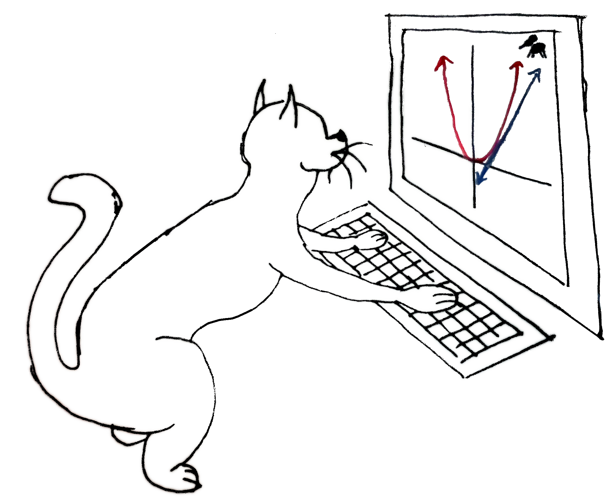

# Mathematical Explorations With Computer Algebra Technology

## Description

This is the source code for a textbook on using Sage to explore mathematics.
It focuses more on introductory programming and using Sage on a topic-by-topic basis.
This repository contains all the relevant data, including old drafts, going back to draft1!

The source code for our Sage textbook has been available
[since its first public release](http://www.math.usm.edu/dont_panic),
but after 5 years, it seems appropriate to make the code available in a manner
more consistent with the times; i.e., GitHub.
We hope that making it available on GitHub will make it easier and more appealing
for others to download, use, and modify to taste.

## Editing

You probably want to start from `draft18`, the most recent version when I uploaded this.

We wrote this using [Lyx](https://www.lyx.org/), but I have exported it to LaTeX
for at least the most recent version. A PDF is included for most drafts.

Graphics appear in the `graphics` directory, hope that doesn't shock anyone.

## License

